# Análisis Exhaustivo del Código Fuente de boinor

> **Resumen**: Análisis completo de la arquitectura, clases, funciones y relaciones en src/boinor. Documento de referencia para desarrollo de gemelo digital y contribuciones al upstream.

## Arquitectura de 3 Capas

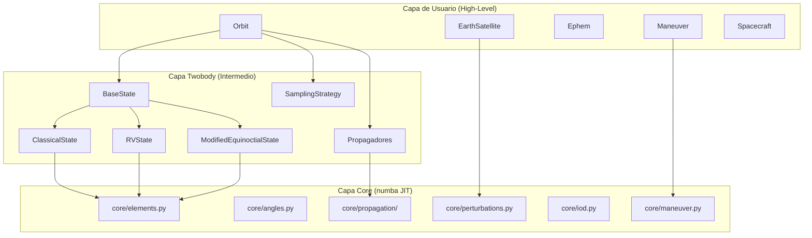

---

## Mapa Completo de Módulos

### Módulos Principales

| Módulo | Propósito | Clases/Funciones Principales |
|--------|-----------|------------------------------|
| `boinor/__init__.py` | Punto de entrada | `__version__ = "0.21.0"` |
| `boinor/bodies.py` | Cuerpos celestes | `Body`, `SolarSystemPlanet`, 20 cuerpos predefinidos |
| `boinor/ephem.py` | Efemérides | `Ephem`, `SincInterpolator`, `SplineInterpolator` |
| `boinor/maneuver.py` | Maniobras orbitales | `Maneuver` (Hohmann, bi-elíptica, Lambert) |
| `boinor/io.py` | I/O de datos | `orbit_from_sbdb()` |
| `boinor/util.py` | Utilidades | `norm()`, `time_range()`, `alinspace()` |
| `boinor/examples.py` | Ejemplos predefinidos | ISS, Molniya, etc. |
| `boinor/warnings.py` | Advertencias | `PatchedConicsWarning`, `TimeScaleWarning` |

### Módulo `core/` (Capa de Núcleo - Numba JIT)

| Archivo | Propósito | Funciones Principales |
|---------|-----------|----------------------|
| `core/elements.py` | Conversiones de elementos orbitales | `coe2rv`, `rv2coe`, `coe2mee`, `mee2coe`, `mee2rv`, `rv_pqw` |
| `core/angles.py` | Conversiones entre anomalías | `M_to_E`, `M_to_F`, `M_to_D`, `E_to_nu`, `F_to_nu`, `D_to_nu`, `newton_factory` |
| `core/propagation/` | Propagación orbital | `farnocchia`, `cowell`, `vallado`, `mikkola`, `markley`, `pimienta`, `gooding`, `danby`, `recseries`, `func_twobody` |
| `core/perturbations.py` | Modelos de perturbación | `J2_perturbation`, `J3_perturbation`, `atmospheric_drag`, `third_body`, `radiation_pressure` |
| `core/iod.py` | Determinación de órbita inicial | `izzo`, `vallado`, `_find_xy`, `_reconstruct`, `_householder` |
| `core/maneuver.py` | Cálculos de maniobras | `hohmann`, `bielliptic`, `correct_pericenter` |
| `core/events.py` | Eventos para propagación | `eclipse_function`, `line_of_sight`, `elevation_function` |
| `core/flybys.py` | Gravedad asistida | `compute_flyby` |
| `core/util.py` | Utilidades matemáticas | `rotation_matrix`, `alinspace`, `spherical_to_cartesian` |

### Módulo `twobody/` (Mecánica de Dos Cuerpos)

| Archivo | Propósito | Clases/Funciones |
|---------|-----------|------------------|
| `twobody/orbit/scalar.py` | Clase principal Orbit | `Orbit` (propagate, sample, apply_maneuver, plot) |
| `twobody/orbit/creation.py` | Métodos de creación | `OrbitCreationMixin` (from_vectors, from_classical, circular, heliosynchronous, frozen) |
| `twobody/states.py` | Representaciones orbitales | `BaseState`, `ClassicalState`, `RVState`, `ModifiedEquinoctialState` |
| `twobody/elements.py` | Wrappers con unidades | `circular_velocity`, `mean_motion`, `period`, `energy`, `coe2rv` |
| `twobody/angles.py` | Wrappers con unidades | `M_to_E`, `M_to_F`, `E_to_nu`, `F_to_nu` |
| `twobody/sampling.py` | Estrategias de muestreo | `SamplingStrategy`, `EpochsArray`, `TrueAnomalyBounds`, `EpochBounds` |
| `twobody/mean_elements.py` | Elementos medios planetarios | `get_mean_elements()` |
| `twobody/propagation/` | Propagadores de alto nivel | `CowellPropagator`, `FarnocchiaPropagator`, `ValladoPropagator`, etc. |

### Módulo `threebody/` (Problema de Tres Cuerpos)

| Archivo | Propósito | Funciones |
|---------|-----------|-----------|
| `threebody/soi.py` | Esfera de influencia | `laplace_radius()`, `hill_radius()` |
| `threebody/flybys.py` | Flybys | Wrappers de `core/flybys.py` |
| `threebody/cr3bp_*.py` | CR3BP | Cálculos de problema de 3 cuerpos restringido |

### Módulo `frames/` (Marcos de Referencia)

| Archivo | Propósito | Clases/Funciones |
|---------|-----------|------------------|
| `frames/enums.py` | Planos de referencia | `Planes` (EARTH_EQUATOR, EARTH_ECLIPTIC, BODY_FIXED) |
| `frames/util.py` | Obtención de frames | `get_frame(attractor, plane, obstime)` |
| `frames/ecliptic.py` | Frames eclípticos | HeliocentricEclipticJ2000, GeocentricMeanEcliptic |
| `frames/equatorial.py` | Frames ecuatoriales | GCRS, HCRS, MercuryICRS, MarsICRS, etc. |
| `frames/fixed.py` | Frames fijos al cuerpo | ITRS, MarsFixed, VenusFixed, etc. |

### Módulo `plotting/` (Visualización)

| Archivo | Propósito | Clases |
|---------|-----------|--------|
| `plotting/orbit/plotter.py` | Plotter principal | `OrbitPlotter`, `Trajectory` |
| `plotting/orbit/backends/matplotlib.py` | Backend 2D | `Matplotlib2D` |
| `plotting/orbit/backends/plotly.py` | Backend 2D/3D | `Plotly2D`, `Plotly3D` |
| `plotting/aitoff.py` | Plotter Aitoff | `AitoffPlotter` |
| `plotting/gabbard.py` | Diagrama Gabbard | `GabbardPlotter` |
| `plotting/porkchop.py` | Gráfico porkchop | `PorkchopPlotter` |
| `plotting/tisserand.py` | Gráfico Tisserand | `TisserandPlotter` |

### Módulo `earth/` (Focalizado en Tierra)

| Archivo | Propósito | Clases/Funciones |
|---------|-----------|------------------|
| `earth/__init__.py` | Satélite terrestre | `EarthSatellite` |
| `earth/enums.py` | Tipos de gravedad | `EarthGravity` (SPHERICAL, J2) |
| `earth/atmosphere/` | Modelos atmosféricos | `COESA62`, `COESA76`, `Jacchia` |
| `earth/plotting/` | Plotting terrestre | `GroundtrackPlotter` |

### Módulo `iod/` (Determinación de Órbita Inicial)

| Archivo | Propósito | Funciones |
|---------|-----------|-----------|
| `iod/izzo.py` | Solver de Lambert (Izzo) | `lambert()` |
| `iod/vallado.py` | Solver de Lambert (Vallado) | `lambert()` |

### Módulo `spacecraft/` (Nave Espacial)

| Archivo | Propósito | Clases |
|---------|-----------|--------|
| `spacecraft/__init__.py` | Modelo de nave | `Spacecraft` (A, C_D, m, ballistic_coefficient) |

### Módulo `constants/` (Constantes)

| Archivo | Propósito | Constantes |
|---------|-----------|------------|
| `constants/general.py` | Constantes físicas | `J2000`, `GM_*`, `R_*`, `J2_*`, `J3_*`, `H0_earth`, `rho0_earth` |
| `constants/mean_elements.py` | Elementos medios | `mean_a_*` (15 cuerpos) |
| `constants/rotational_elements.py` | Períodos rotacionales | `rotational_period_*` (12 cuerpos) |

### Módulo `_math/` (Matemáticas Auxiliares)

| Archivo | Propósito | Funciones |
|---------|-----------|-----------|
| `_math/ivp.py` | Integración numérica | `DOP853`, `solve_ivp` (re-export de scipy) |
| `_math/linalg.py` | Álgebra lineal | `norm()` |
| `_math/special.py` | Funciones especiales | `hyp2f1b()`, `stumpff_c2()`, `stumpff_c3()` |
| `_math/interpolate.py` | Interpolación | Wrappers de scipy |
| `_math/optimize.py` | Optimización | Wrappers de scipy |

---

## Jerarquía de Clases

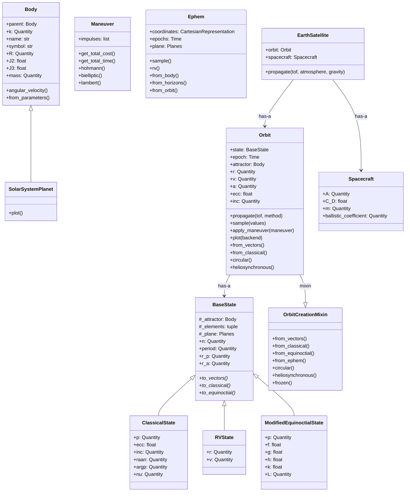

---

## Propagadores Soportados

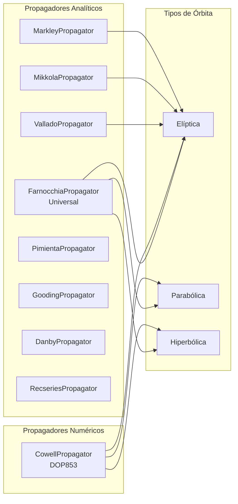

| Propagador | Tipo | Perturbaciones | Casos Soportados |
|------------|------|----------------|------------------|
| **Farnocchia** | Analítico universal | No | Elíptica, parabólica, hiperbólica |
| **Cowell** | Numérico (DOP853) | Sí | Elíptica, parabólica, hiperbólica |
| **Vallado** | Analítico | No | Elíptica |
| **Mikkola** | Analítico | No | Elíptica |
| **Markley** | Analítico | No | Elíptica |
| **Pimienta** | Analítico | No | Elíptica |
| **Gooding** | Analítico | No | Elíptica |
| **Danby** | Analítico | No | Elíptica |
| **Recseries** | Analítico | No | Elíptica |

---

## Modelos de Perturbación

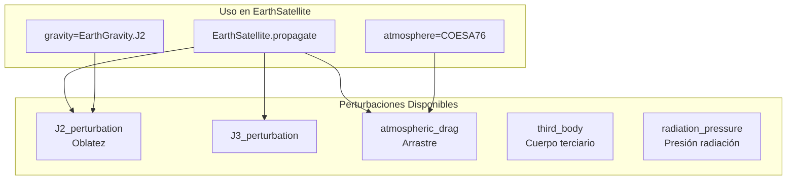

| Perturbación | Fórmula | Efecto |
|--------------|---------|--------|
| **J2** | `p = (3/2)*k*J2*R²/r^5 * [x/r*(5z²/r²-1), ...]` | Precesión de nodo y pericentro |
| **J3** | Similar a J2, orden superior | Correcciones menores |
| **Arrastre** | `p = -(1/2)*ρ*v*B*v_vec` | Decaimiento orbital |
| **Tercer cuerpo** | `p = k_third * (delta_r/|delta_r|³ - body_r/|body_r|³)` | Perturbación gravitatoria |
| **Radiación** | `p = -ν*P_s*C_R*A/m * r_star/|r_star|` | Empuje solar |

---

## Algoritmos Clave

### 1. Propagación de Farnocchia (Analítico Universal)

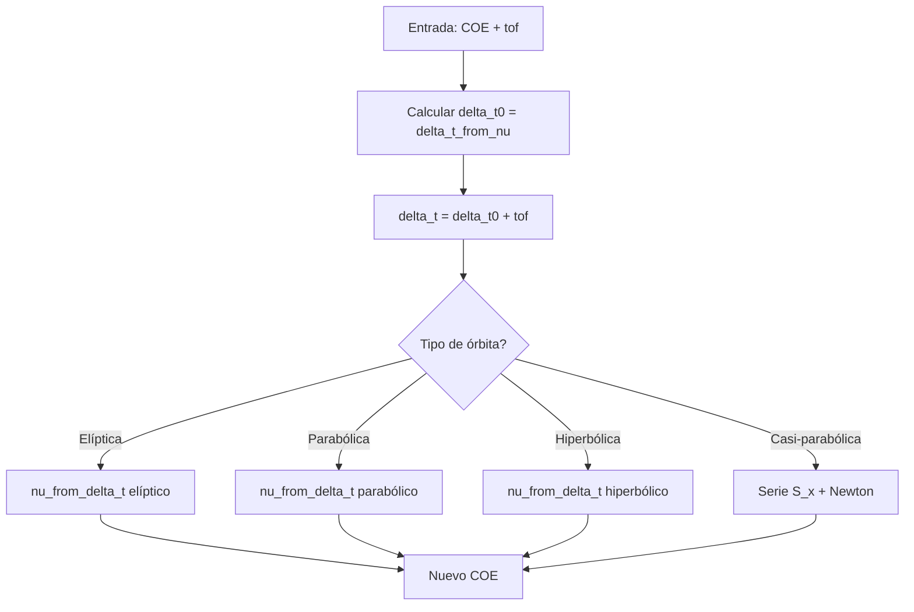

**Base**: Paper Farnocchia et al. 2013 (DOI: 10.1007/s10569-013-9476-9)

**Ventajas**: Analítico, rápido, sin integración numérica  
**Limitaciones**: No maneja perturbaciones

### 2. Propagación de Cowell (Numérico)

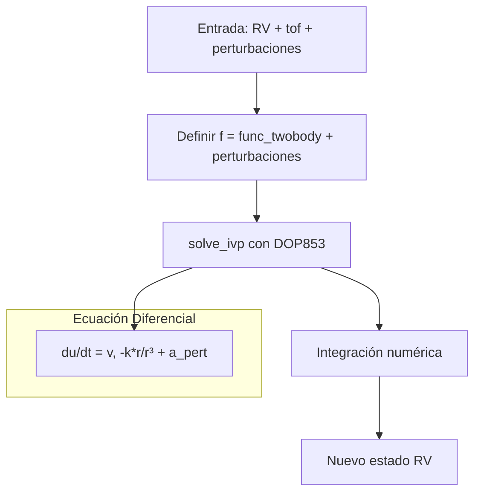

**Ventajas**: Maneja perturbaciones arbitrarias, eventos  
**Limitaciones**: Más lento, acumula error de integración

### 3. Conversión RV ↔ COE

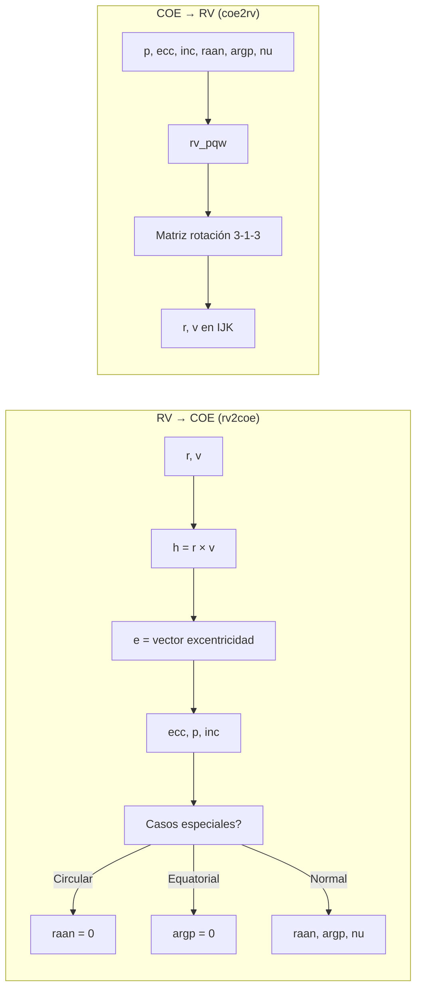

**Complejidad**: Maneja casos degenerados (circular, equatorial, circular+equatorial)

### 4. Problema de Lambert (Algoritmo de Izzo)

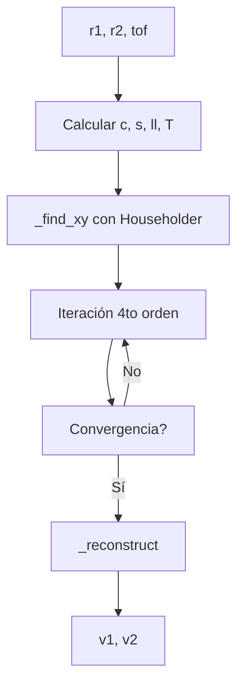

**Método de Householder**: Iteración de cuarto orden para convergencia rápida

### 5. Transferencia de Hohmann

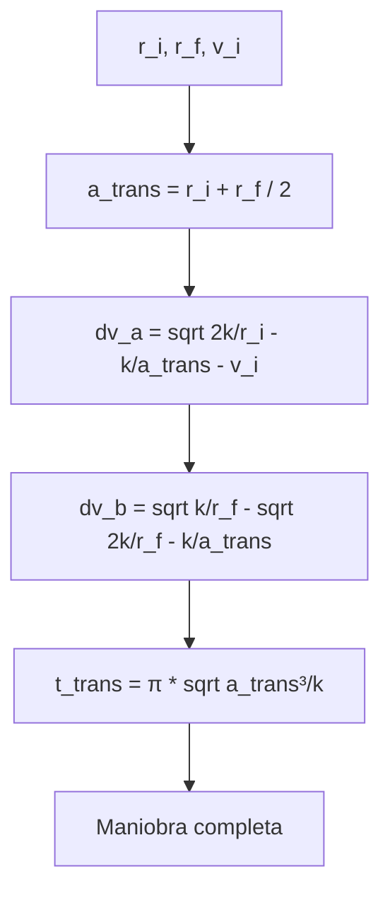

---

## Flujo de Datos

### De Entrada del Usuario a Cálculos Orbitales

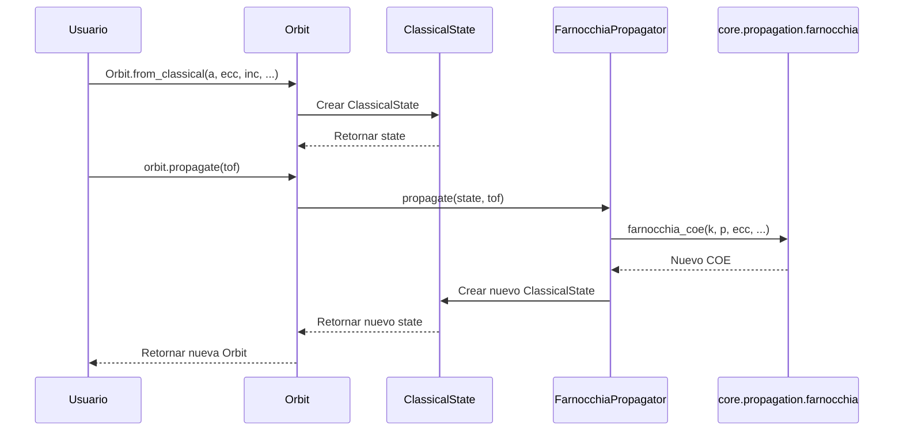

### De Estado Orbital a Visualización

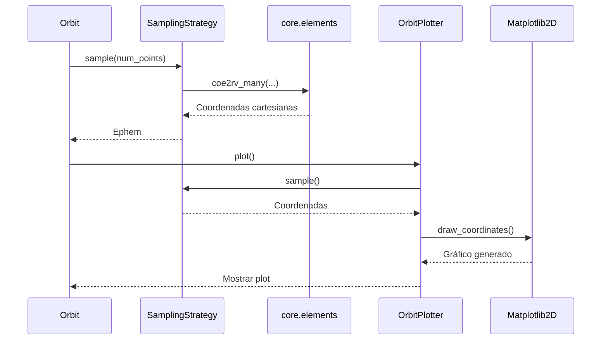

### De Perturbaciones a Propagación

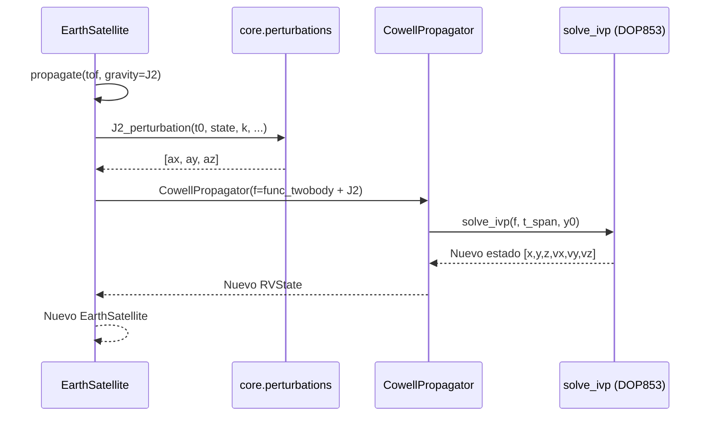

---

## API Pública

### Exportaciones Principales

```python
# Módulos principales
from boinor.twobody import Orbit
from boinor.bodies import Earth, Mars, Sun, Moon
from boinor.maneuver import Maneuver
from boinor.ephem import Ephem
from boinor.frames import Planes
from boinor.earth import EarthSatellite
from boinor.spacecraft import Spacecraft
from boinor.plotting import OrbitPlotter
from boinor.iod import lambert

# Propagadores
from boinor.twobody.propagation import (
    FarnocchiaPropagator,  # Default
    CowellPropagator,      # Numérico con perturbaciones
    ValladoPropagator,
    MikkolaPropagator,
    MarkleyPropagator,
    PimientaPropagator,
    GoodingPropagator,
    DanbyPropagator,
    RecseriesPropagator,
)

# Perturbaciones
from boinor.core.perturbations import (
    J2_perturbation,
    J3_perturbation,
    atmospheric_drag,
    third_body,
    radiation_pressure,
)
```

### Métodos de Orbit

```python
# Creación
orbit = Orbit.from_vectors(Earth, r, v, epoch=J2000)
orbit = Orbit.from_classical(Earth, a, ecc, inc, raan, argp, nu)
orbit = Orbit.circular(Earth, alt=400*u.km)
orbit = Orbit.heliosynchronous(Earth, a=7000*u.km, ecc=0.0)
orbit = Orbit.frozen(Earth, alt=800*u.km)

# Propiedades
orbit.r, orbit.v          # Posición y velocidad
orbit.a, orbit.ecc        # Semi-eje mayor, excentricidad
orbit.inc, orbit.raan     # Inclinación, ascensión recta
orbit.argp, orbit.nu      # Argumento pericentro, anomalía verdadera
orbit.period, orbit.n     # Período, movimiento medio
orbit.energy              # Energía específica

# Métodos
new_orbit = orbit.propagate(1*u.hour)
ephem = orbit.to_ephem()
positions = orbit.sample(100)
final = orbit.apply_maneuver(maneuver)
orbit.plot()
```

---

## Métricas del Código

| Aspecto | Detalle |
|---------|---------|
| **Módulos** | ~50 archivos Python en 15 subpaquetes |
| **Clases principales** | ~15 clases (Body, Orbit, BaseState, Maneuver, Ephem, Spacecraft, EarthSatellite, OrbitPlotter, etc.) |
| **Propagadores** | 9 propagadores (3 numéricos/analíticos universales, 6 analíticos específicos) |
| **Estados orbitales** | 3 representaciones (Clásica, RV, Equinoccial Modificada) |
| **Modelos de perturbación** | 5 tipos (J2, J3, arrastre, tercer cuerpo, radiación) |
| **Solvers de Lambert** | 2 (Izzo, Vallado) |
| **Maniobras** | 5 tipos (impulso, Hohmann, bi-elíptica, Lambert, corrección pericentro) |
| **Backends de plotting** | 2 (Matplotlib2D, Plotly2D) |
| **Frames** | 3 planos × 9 cuerpos = ~27 frames definidos |
| **Cuerpos predefinidos** | 20 cuerpos del Sistema Solar |
| **Constantes** | ~200 constantes astronómicas |

---

## Patrones de Diseño

| Patrón | Implementación | Propósito |
|--------|----------------|-----------|
| **State** | `BaseState` con 3 subclases | Representaciones orbitales intercambiables |
| **Mixin** | `OrbitCreationMixin` | Separar métodos de construcción |
| **Strategy** | `SamplingStrategy` | Estrategias de muestreo |
| **Duck-Typing** | Propagadores | Interfaz uniforme sin herencia |
| **Template Method** | `OrbitPlotterBackend` | Backends de visualización |
| **Decorator** | `@u.quantity_input` | Validación de unidades en runtime |

---

## Conclusiones

**boinor** es una librería bien estructurada con una arquitectura de 3 capas clara:

1. **Capa de núcleo (`core/`)**: Cálculos de bajo nivel con `numba JIT` para rendimiento. Funciones puras sin unidades.
2. **Capa de twobody (`twobody/`)**: Wrappers con `astropy.units` para manejo de unidades físicas. Clase `Orbit` central.
3. **Capa de usuario**: Plotting, maniobras, efemérides, y utilidades específicas.

**Puntos fuertes**:
- Soporte completo de unidades astropy (no hay números mágicos)
- 9 propagadores cubriendo todos los tipos de órbitas
- Manejo de perturbaciones (J2, J3, arrastre, tercer cuerpo, radiación)
- Solvers robustos del problema de Lambert
- Visualización flexible con múltiples backends
- Cuerpos predefinidos del Sistema Solar con constantes IAU

**Áreas de complejidad**:
- La conversión `RV <-> COE` maneja casos degenerados
- El propagador de Farnocchia maneja 5 casos diferentes
- El algoritmo de Izzo usa métodos de convergencia de alto orden
- La propagación con Cowell usa integración de alto orden (DOP853)
