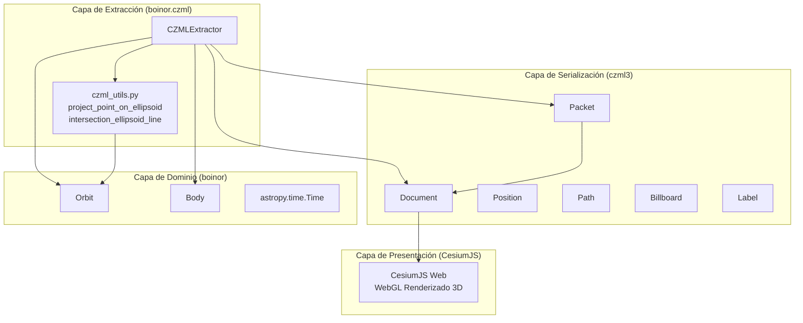
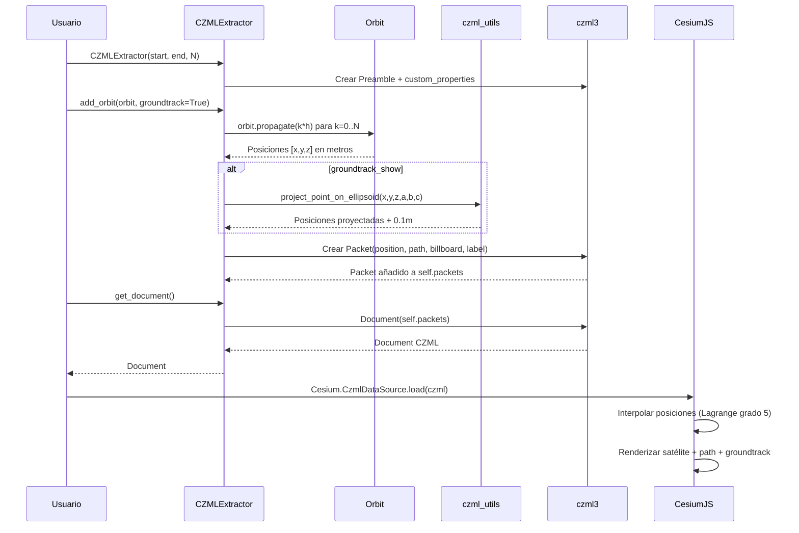
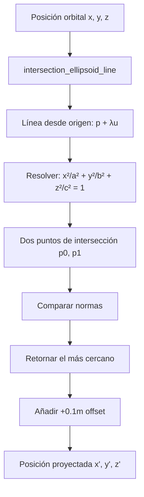

# Análisis Exhaustivo del Módulo CZML de boinor

> **Resumen**: El módulo CZML es una capa de exportación funcional pero básica (~675 líneas de código). Genera documentos CZML para visualización 3D en CesiumJS. Para un gemelo digital necesita: actualización de czml3, soporte para orientación/velocidad/sensores, modelos 3D, y streaming incremental.

## Estructura del Módulo

```
src/boinor/czml/
├── __init__.py          # Vacío — no exporta nada
└── extract_czml.py      # Módulo principal (574 líneas)

src/boinor/core/
└── czml_utils.py        # Funciones de utilidad numérica (100 líneas)

tests/
└── test_czml.py         # Suite de tests (919 líneas)

docs/source/examples/
└── czml-tutorial.myst.md # Tutorial de usuario
```

---

## Arquitectura



### Patrones de Diseño

| Patrón | Implementación | Propósito |
|--------|----------------|-----------|
| **Builder** | `CZMLExtractor` acumula `Packet` en `self.packets` | Construcción incremental del documento |
| **Strategy** | `_init_orbit_packet_cords_` vs `_init_groundtrack_packet_cords_` | Dos estrategias de muestreo |
| **State** | `self.i` y `self.gs_n` como contadores | Estado de construcción |
| **DTO** | Objetos `czml3.Packet` | Transferencia de datos serializable |

---

## Clase Principal: `CZMLExtractor`

**Ubicación**: `src/boinor/czml/extract_czml.py:47`

### Constructor

```python
class CZMLExtractor:
    def __init__(
        self,
        start_epoch: Time,      # Época inicial del documento
        end_epoch: Time,        # Época final
        N: int,                 # Número de puntos de muestreo
        attractor: Body = None, # Cuerpo central (default: Earth)
        pr_map: str = None,     # URL a mapa UV de textura
        scene3D: bool = True,   # Modo 3D vs proyección 2D
    )
```

### Atributos Internos

| Atributo | Tipo | Propósito |
|----------|------|-----------|
| `self.packets` | `list[Packet]` | Lista acumulativa de todos los CZML packets |
| `self.orbits` | `list[[Orbit, int, Time]]` | Órbitas añadidas con sus parámetros |
| `self.trajectories` | `list[Any]` | Trayectorias precomputadas |
| `self.i` | `int` | Contador de IDs para órbitas/trayectorias |
| `self.gs_n` | `int` | Contador de IDs para ground stations |
| `self.cust_prop` | `[ellipsoid, pr_map, scene3D]` | Parámetros custom del atractor |

### Validaciones

- Si `attractor` es `None`, usa `Earth`
- Si `attractor.R` o `attractor.R_polar` son `None` o `0`, lanza `ValueError`

---

## Métodos Públicos

### `add_orbit()`

```python
def add_orbit(
    self,
    orbit: Orbit,
    rtol: float = 1e-10,
    N: int = None,
    groundtrack_show: bool = False,
    groundtrack_lead_time: float = None,
    groundtrack_trail_time: float = None,
    groundtrack_width: float = None,
    groundtrack_color: list = None,
    id_name: str = None,
    id_description: str = None,
    path_width: float = None,
    path_show: bool = None,
    path_color: list = None,
    label_fill_color: list = None,
    label_outline_color: list = None,
    label_font: str = None,
    label_text: str = None,
    label_show: bool = None,
)
```

**Propósito**: Añade una órbita propagada al documento CZML con path, billboard (icono satélite), label y groundtrack opcional.

**Validaciones**:
- Si `orbit.epoch < start_epoch`: propaga hacia adelante hasta `start_epoch`
- Si `orbit.epoch > end_epoch`: lanza `ValueError`
- Si `rtol <= 0 or rtol >= 1`: lanza `ValueError`

**Packets generados**:
1. **Packet órbita**: Position + Path + Billboard + Label
2. **Packet groundtrack** (opcional): Position proyectada + Path

**FIXME**: `rtol` no se usa con el método de propagación por defecto (línea 137)

---

### `add_trajectory()`

```python
def add_trajectory(
    self,
    positions: CartesianRepresentation,
    epochs: Time,
    groundtrack_show: bool = False,
    # ... mismos parámetros visuales que add_orbit
)
```

**Propósito**: Añade una trayectoria precomputada (posiciones + épocas) en lugar de propagar una órbita.

**Validaciones**:
- `len(epochs) == len(positions)` o `ValueError`

**Limitación**: Lanza `NotImplementedError` si se solicita `groundtrack_show=True`

---

### `add_ground_station()`

```python
def add_ground_station(
    self,
    pos: list[Quantity],  # [lon, lat] en grados
    id_description: str = None,
    label_fill_color: list = None,
    label_font: str = None,
    label_outline_color: list = None,
    label_text: str = None,
    label_show: bool = True,
)
```

**Propósito**: Añade una estación terrestre como punto fijo en el elipsoide.

**Implementación**:
1. Valida que `pos` tenga 2 elementos de tipo `Quantity`
2. Calcula el flattening `f = 1 - b/a`
3. Usa `erfa.gd2gce` (geodésico a cartesiano elipsoidal) para convertir a cartesianas
4. Crea `Packet(id=f"GS{self.gs_n}", ...)` con Billboard + Label

---

### `get_document()`

```python
def get_document(self) -> Document
```

**Propósito**: Materializa el `Document` CZML a partir de `self.packets`

---

## Métodos Privados

### `_init_czml_()` (línea 193)

**Propósito**: Crea el packet de preámbulo/documento obligatorio de CZML

**Implementación**: Construye un `Preamble` con:
- `name="document_packet"`
- `clock=IntervalValue(start, end, value=Clock(currentTime, multiplier=60))`

---

### `_change_custom_params()` (línea 208)

**Propósito**: Crea el packet `custom_properties` con metadatos del atractor

**Implementación**: Construye un `Packet(id="custom_properties", properties=...)` con:
- `custom_attractor: True`
- `ellipsoid: [{"array": [a, b, c]}]`
- `map_url`: URL o lista con URL
- `scene3D`: bool

**Nota**: El mapa por defecto es `https://commons.wikimedia.org/wiki/File:Earthmap1000x500.jpg` (el archivo original ya no está disponible)

---

### `_init_orbit_packet_cords_()` (línea 114)

```python
def _init_orbit_packet_cords_(self, i: int, rtol: float) -> list[float]
```

**Propósito**: Muestrea una órbita en `N` puntos y genera coordenadas cartesianas interpolables

**Implementación**:
1. Calcula `h = (end_epoch - orbit_epoch) / N` en segundos
2. Itera `k = 0..N+1` (nota: `N+2` puntos total)
3. Propaga la órbita con `TimeDelta(k * h)`
4. Obtiene `orbit.r` (vector posición) en metros
5. Inserta `h.value * k` como tiempo relativo al inicio
6. Redondea valores según factor derivado de `rtol`

**Retorno**: `list[float]` — lista aplanada de `[t0, x0, y0, z0, t1, x1, y1, z1, ...]`

---

### `_init_groundtrack_packet_cords_()` (línea 148)

**Propósito**: Similar al anterior, pero proyecta cada punto sobre la superficie del elipsoide

**Implementación**:
1. Igual muestreo que `_init_orbit_packet_cords_`
2. Para cada punto `(x, y, z)`:
   - Llama a `project_point_on_ellipsoid_fast(x, y, z, a, b, c)` (de `czml_utils`)
3. Añade `0.1` metro a cada coordenada proyectada para evitar z-fighting/errores de precisión

**Hack**: El `+0.1` es un workaround numérico para que el punto no quede ligeramente bajo la superficie

---

## Funciones de Utilidad (`core/czml_utils.py`)

### `intersection_ellipsoid_line()` (línea 9)

```python
@jit
def intersection_ellipsoid_line(
    x, y, z,      # Punto de origen
    u1, u2, u3,   # Vector dirección
    a, b, c,      # Semiejes del elipsoide
) -> tuple[np.ndarray, np.ndarray]
```

**Propósito**: Calcula la intersección de un elipsoide `(a, b, c)` con la línea `p + λu`

**Implementación**: Solución algebraica cerrada. Reduce un parámetro dividiendo por `u1` (asume `u1 ≠ 0`). Usa `numba @jit` para aceleración.

**Retorno**: `(p0, p1)` — dos puntos de intersección

---

### `project_point_on_ellipsoid()` (línea 84)

```python
@jit
def project_point_on_ellipsoid(
    x, y, z,  # Punto a proyectar
    a, b, c,  # Semiejes del elipsoide
) -> np.ndarray
```

**Propósito**: Proyecta un punto 3D sobre la superficie del elipsoide

**Implementación**:
1. Llama a `intersection_ellipsoid_line(x, y, z, x, y, z, a, b, c)` — línea desde el origen al punto
2. Compara normas de los dos puntos de intersección
3. Retorna el más cercano al punto original

---

## Formato CZML Generado

### ¿Qué es CZML?

**CZML** (Cesium Language) es un formato JSON para describir escenas gráficas dinámicas en el tiempo, diseñado para CesiumJS. Es análogo a la relación entre KML y Google Earth.

**Características**:
- Basado en JSON
- Toda propiedad es time-dynamic (puede cambiar con el tiempo)
- Soporta interpolación (Lagrange, Hermite, Linear)
- Optimizado para streaming incremental
- Extensible

### Estructura del Documento

#### Packet 1: Documento (Preamble)

```json
{
  "id": "document",
  "version": "1.0",
  "name": "document_packet",
  "clock": {
    "interval": "2013-03-18T12:00:00Z/2013-03-18T23:59:35Z",
    "currentTime": "2013-03-18T12:00:00Z",
    "multiplier": 60,
    "range": "LOOP_STOP",
    "step": "SYSTEM_CLOCK_MULTIPLIER"
  }
}
```

#### Packet 2: Custom Properties

```json
{
  "id": "custom_properties",
  "properties": {
    "custom_attractor": true,
    "ellipsoid": [{"array": [6378136.6, 6378136.6, 6356751.9]}],
    "map_url": ["https://commons.wikimedia.org/..."],
    "scene3D": true
  }
}
```

#### Packet 3+: Órbita

```json
{
  "id": 0,
  "availability": "2013-03-18T12:00:00Z/2013-03-18T23:59:35Z",
  "position": {
    "epoch": "2013-03-18T12:00:00Z",
    "interpolationAlgorithm": "LAGRANGE",
    "interpolationDegree": 5,
    "referenceFrame": "INERTIAL",
    "cartesian": [0.0, x0, y0, z0, 4317.5108, x1, y1, z1, ...]
  },
  "billboard": {
    "image": "data:image/png;base64,...",
    "show": true
  },
  "label": {
    "text": "Molniya",
    "font": "11pt Lucida Console",
    "style": "FILL",
    "fillColor": {"rgba": [125, 80, 120, 255]},
    "outlineColor": {"rgba": [255, 255, 0, 255]},
    "outlineWidth": 1.0
  },
  "path": {
    "resolution": 120,
    "material": {
      "solidColor": {
        "color": {"rgba": [255, 255, 0, 255]}
      }
    }
  }
}
```

#### Packet N: Groundtrack (opcional)

```json
{
  "id": "groundtrack0",
  "availability": "...",
  "position": {
    "epoch": "...",
    "interpolationAlgorithm": "LAGRANGE",
    "interpolationDegree": 5,
    "referenceFrame": "INERTIAL",
    "cartesian": [0.0, x_proj, y_proj, z_proj, ...]
  },
  "path": {
    "show": true,
    "leadTime": 100,
    "trailTime": 100,
    "resolution": 60,
    "material": {
      "solidColor": {"color": {"rgba": [255, 255, 0, 255]}}
    }
  }
}
```

#### Packet M: Ground Station

```json
{
  "id": "GS0",
  "availability": "...",
  "position": {
    "cartesian": [2546008.4, 1590922.6, 5608514.9]
  },
  "billboard": {
    "image": "data:image/png;base64,...",
    "show": true
  },
  "label": {
    "show": true,
    "text": "GS test",
    "font": "11pt Lucida Console",
    "style": "FILL",
    "fillColor": {"rgba": [120, 120, 120, 255]},
    "outlineWidth": 1.0
  }
}
```

---

## Flujo de Datos



### Groundtrack (proyección elipsoidal)



---

## Características Soportadas

| Característica | Estado | Detalle |
|----------------|--------|---------|
| **Órbitas propagadas** | ✅ Completo | `add_orbit()` con propagación automática |
| **Trayectorias precomputadas** | ✅ Completo | `add_trajectory()` con `CartesianRepresentation` |
| **Groundtrack** | ✅ Completo | Proyección elipsoidal para `add_orbit()` |
| **Estaciones terrestres** | ✅ Completo | `add_ground_station()` con conversión geodésica→cartesiana |
| **Múltiples órbitas** | ✅ Completo | IDs incrementales `0, 1, 2...` |
| **Personalización visual** | ✅ Parcial | Color, grosor, fuente, etiqueta, icono |
| **Atractor custom** | ✅ Completo | Cualquier `Body` con `R` y `R_polar` |
| **Mapa UV custom** | ✅ Completo | URL de textura configurable |
| **Modo 2D/3D** | ✅ Completo | `scene3D` boolean |
| **Interpolación** | ✅ Completo | Lagrange grado 5 (hardcoded) |
| **Groundtrack para trayectorias** | ❌ No implementado | Lanza `NotImplementedError` |
| **Modelos 3D (glTF)** | ❌ No soportado | Solo billboards PNG |
| **Sensores / conos** | ❌ No soportado | No hay API |
| **Zonas de visibilidad** | ❌ No soportado | No hay API |
| **Velocidad / orientación** | ❌ No soportado | Solo posición |
| **Polígonos / polylines** | ❌ No soportado | Solo path básico |

---

## Limitaciones

### Técnicas

1. **Interpolación fija**: `interpolationDegree=5` y `LAGRANGE` están hardcoded. No se puede elegir `HERMITE` o grado diferente.
2. **rtol sin uso**: El parámetro `rtol` no afecta la propagación por defecto (FIXME en código).
3. **Groundtrack para trayectorias**: No implementado (`NotImplementedError`).
4. **Solo posición**: No se exporta velocidad, orientación (quaternions), ni actitud.
5. **Billboards estáticos**: No hay soporte para modelos 3D (glTF), solo imágenes PNG base64.
6. **Sin sensores**: No se pueden visualizar conos de visibilidad, campos de vista, o áreas de cobertura.
7. **Muestreo uniforme**: No hay estrategia de muestreo adaptativo (más puntos en pericentro, menos en apocentro).
8. **Colores únicos**: Solo material `SolidColor`, no texturas ni degradados.
9. **Mapa por defecto roto**: El comentario en línea 224-225 indica que el mapa original de Wikimedia ya no está disponible.
10. **Sin streaming**: Todo el documento se genera en memoria; no hay modo de streaming incremental a Cesium.

### Dependencia czml3

**Versión requerida**: `~=0.5.3` (según `pyproject.toml:81`)

**Versión actual en PyPI**: `3.3.1` (mayo 2026)

**Brecha**: boinor fuerza una versión muy antigua. La versión 3.x usa Pydantic, tiene mejor serialización, y posiblemente cambios en la API.

---

## Testing

### Suite de Tests: `tests/test_czml.py` (919 líneas)

| Test | Línea | Propósito | Estado |
|------|-------|-----------|--------|
| `test_czml_get_document` | 24 | Verifica que `get_document()` retorna `Document` correcto | ✅ |
| `test_czml_custom_packet` | 37 | Verifica `custom_properties` con Marte y parámetros custom | ✅ |
| `test_czml_add_orbit` | 82 | Test end-to-end con 2 órbitas (Molniya + ISS) | ⚠️ `xfail` |
| `test_czml_add_orbit_negative_rtol_raises_error_if_beyond_range` | 333 | Verifica validación de `rtol` | ✅ |
| `test_czml_add_trajectory` | 452 | Test de `add_trajectory()` con datos artificiales | ✅ |
| `test_czml_raises_error_if_length_of_points_and_epochs_not_same` | 478 | Verifica validación de longitudes | ✅ |
| `test_czml_groundtrack` | 499 | Test de groundtrack con Molniya | ✅ |
| `test_czml_ground_station` | 726 | Test de 2 ground stations con coordenadas geodésicas | ✅ |
| `test_czml_preamble` | 824 | Verifica el packet documento inicial | ✅ |
| `test_czml_invalid_orbit_epoch_error` | 871 | Verifica error si época de órbita > end_epoch | ✅ |
| `test_czml_add_ground_station_raises_error_if_invalid_coordinates` | 882 | Verifica error de coordenadas inválidas | ✅ |
| `test_czml_add_trajectory_raises_error_for_groundtrack_show` | 897 | Verifica `NotImplementedError` | ✅ |

### Calidad de los Tests

**Fortalezas**:
- Cobertura de todos los métodos públicos
- Tests de validación de errores
- Comparación de salida JSON exacta (repr comparison)

**Debilidades**:
- `test_czml_add_orbit` está marcado como `xfail` por diferencias numéricas en propagación
- No hay tests para `czml_utils.py` (intersección elipsoide/proyección)
- No hay tests de rendimiento para N grande
- No hay tests con múltiples attractors más allá de Marte

---

## Oportunidades para Gemelo Digital

### Capacidades Actuales Aprovechables

1. **Visualización orbital 3D en tiempo real**: CZML + CesiumJS permite mostrar la posición actual del satélite interpolada
2. **Groundtrack histórico**: Útil para análisis de cobertura y planificación de misiones
3. **Múltiples objetos**: Soporte nativo para constelaciones
4. **Estaciones terrestres**: Referencia visual para análisis de contacto

### Brechas para un Gemelo Digital Completo

| Capacidad | Prioridad | Qué necesita el módulo CZML |
|-----------|-----------|------------------------------|
| **Telemetría real-time** | 🔴 Crítica | Ingesta de TLE/CCSDS → `add_trajectory()` con streaming |
| **Modelos de subsistemas** | 🔴 Crítica | No aplica directamente a CZML, pero sí a la capa de datos |
| **Sensores/FOV** | 🟡 Alta | Extender `add_orbit()` para incluir `Sensor` / `Pyramid` CZML |
| **Velocidad y orientación** | 🟡 Alta | Añadir `velocity` y `orientation` (quaternion) a los packets |
| **Conos de visibilidad** | 🟡 Alta | Calcular y exportar polígonos de cobertura |
| **Fault injection** | 🟡 Media | Cambiar colores/estados de objetos según modo de fallo |
| **API REST** | 🟡 Media | Serializar `Document` a JSON endpoint |

### Extensiones Propuestas para CZML

1. **Campo de visión (FOV)**: Usar `czml3.properties.Pyramid` o `Cone` para representar sensores
2. **Zonas de cobertura**: Usar `Polygon` con `availability` para mostrar áreas de cobertura terrestre
3. **Orientación**: Exportar `orientation` (quaternion) para mostrar actitud del satélite
4. **Velocidad**: Añadir `velocity` a `Position` para vectores de velocidad
5. **Modelo 3D**: Reemplazar `billboard` por `model` (glTF) para representación realista
6. **Eventos**: Usar `Event` CZML para maniobras, eclipses, etc.

---

## Dependencias Externas

### czml3

**API usada por boinor**:

| Componente | Uso en boinor |
|------------|---------------|
| `czml3.core.Document` | `get_document()` |
| `czml3.core.Packet` | Todos los packets |
| `czml3.core.Preamble` | `_init_czml_()` |
| `czml3.enums.InterpolationAlgorithms` | `LAGRANGE` |
| `czml3.enums.ReferenceFrames` | `INERTIAL` |
| `czml3.properties.Billboard` | Icono satélite/GS |
| `czml3.properties.Clock` | Reloj del documento |
| `czml3.properties.Color` | Colores RGBA |
| `czml3.properties.Label` | Etiquetas de texto |
| `czml3.properties.Material` | Materiales de path |
| `czml3.properties.Path` | Trayectorias |
| `czml3.properties.Position` | Posiciones cartesianas |
| `czml3.properties.SolidColorMaterial` | Color sólido |
| `czml3.types.IntervalValue` | Intervalo de reloj |
| `czml3.types.TimeInterval` | Disponibilidad temporal |

### Otras Dependencias

| Librería | Uso | Ubicación |
|----------|-----|-----------|
| `astropy.units` | Conversión de unidades | Todo el módulo |
| `astropy.time.Time` | Épocas y tiempo | `__init__`, `add_orbit`, `add_trajectory` |
| `astropy.time.TimeDelta` | Propagación temporal | `_init_orbit_packet_cords_` |
| `astropy.coordinates.CartesianRepresentation` | Posiciones 3D | `add_trajectory` |
| `numpy` | Arrays, redondeo, concatenación | Todo el módulo |
| `erfa.gd2gce` | Geodésico → cartesiano elipsoidal | `add_ground_station` |
| `numba` | JIT en `czml_utils` | `intersection_ellipsoid_line` |

---

## Resumen de Rutas de Archivo

| Elemento | Archivo | Línea(s) |
|----------|---------|----------|
| `CZMLExtractor` | `src/boinor/czml/extract_czml.py` | 47-573 |
| `__init__` | `src/boinor/czml/extract_czml.py` | 50-113 |
| `_init_orbit_packet_cords_` | `src/boinor/czml/extract_czml.py` | 114-146 |
| `_init_groundtrack_packet_cords_` | `src/boinor/czml/extract_czml.py` | 148-191 |
| `_init_czml_` | `src/boinor/czml/extract_czml.py` | 193-206 |
| `_change_custom_params` | `src/boinor/czml/extract_czml.py` | 208-237 |
| `add_ground_station` | `src/boinor/czml/extract_czml.py` | 239-303 |
| `add_orbit` | `src/boinor/czml/extract_czml.py` | 305-449 |
| `add_trajectory` | `src/boinor/czml/extract_czml.py` | 451-570 |
| `get_document` | `src/boinor/czml/extract_czml.py` | 572-573 |
| `intersection_ellipsoid_line` | `src/boinor/core/czml_utils.py` | 9-80 |
| `project_point_on_ellipsoid` | `src/boinor/core/czml_utils.py` | 84-100 |
| `norm` | `src/boinor/_math/linalg.py` | 7-8 |
| `PIC_SATELLITE` | `src/boinor/czml/extract_czml.py` | 28-36 |
| `PIC_GROUNDSTATION` | `src/boinor/czml/extract_czml.py` | 37-44 |
| Tests CZML | `tests/test_czml.py` | 1-919 |
| Tutorial | `docs/source/examples/czml-tutorial.myst.md` | 1-190 |
| Dependencia czml3 | `pyproject.toml` | 81 |

---

## Veredicto Final

El módulo CZML de boinor es una **capa de exportación funcional pero básica** (~675 líneas de código efectivo). Su arquitectura es simple y directa: un builder (`CZMLExtractor`) que acumula packets y los serializa.

**Fortalezas**:
- Código limpio y bien documentado
- Lógica matemática correcta (proyección elipsoidal con Numba)
- Tests cubren funcionalidad principal
- Integración sólida con czml3 (para lo que hace)

**Debilidades**:
- Usa versión muy antigua de czml3 (0.5.3 vs 3.3.1 actual)
- Funcionalidad limitada (solo posición, billboards, paths básicos)
- Sin soporte para orientación, velocidad, sensores, modelos 3D
- Sin streaming incremental
- Groundtrack para trayectorias no implementado

Para un **gemelo digital operacional**, el módulo necesita:
1. Actualización de czml3
2. Soporte para orientación, velocidad, sensores
3. Modelos 3D en lugar de billboards
4. Streaming incremental o generación por intervalos
5. Integración con telemetría real-time

**Complejidad total**: ~675 líneas de código + 919 líneas de tests. Es un módulo pequeño y enfocado, lo cual es una fortaleza para mantenimiento, pero una limitación para funcionalidad avanzada.
